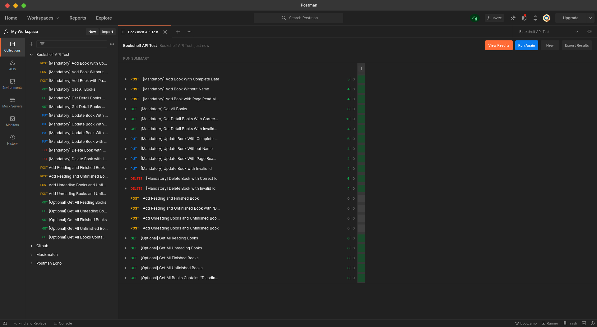

# Bookshelf API

Want to use? Install it using this command: (Make sure you already installed nodejs and npm)
```
npm install
npm run start
```

## Dependencies:
- Development:
    - Eslint (use AirBnB)
    - Nodemon
- Hapi
- Nanoid

## Criteria:
1. API can save object
    - method: POST
    - url: /books
    - status_code: 400, 500, 201
2. API can show all objects
    - method: GET
    - url: /books
    - status_code: 200
3. API can show object detail
    - method: GET
    - url: /books/{bookId}
    - status_code: 404, 200
4. API can update object
    - method: PUT
    - url: /books/{booksId}
    - status_code: 400, 404, 200
5. API can delete object
    - method: DELETE
    - url: /books/{booksId}
    - status_code: 404, 200

## Result:
